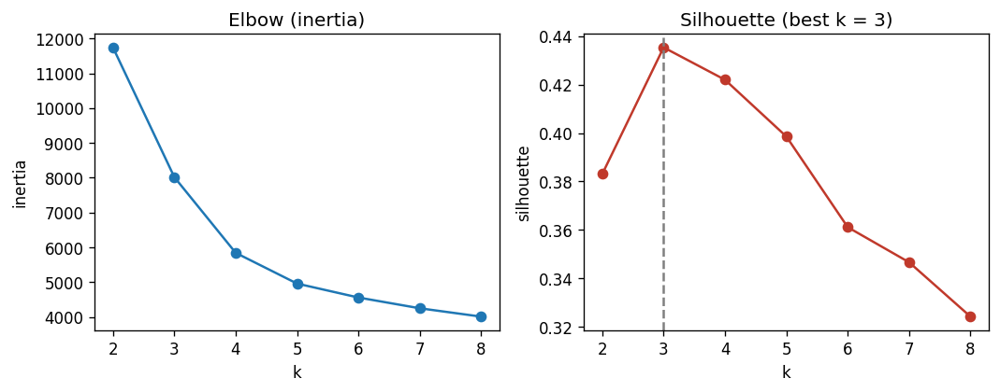
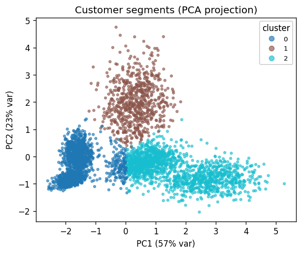

<div align="center">

</div>

# E-Commerce Customer Segmentation — Unsupervised ML

[](https://huggingface.co/spaces/ashishjangra284/ecommerce-customer-segmentation)

**🚀 Try it live:** https://huggingface.co/spaces/ashishjangra284/ecommerce-customer-segmentation

[](https://github.com/ashishlandiwal/ecommerce-customer-segmentation/actions/workflows/ci.yml)


Segment customers from RFM (Recency, Frequency, Monetary) behaviour using **KMeans** and
**DBSCAN**, choose the number of clusters with the **Elbow + Silhouette** methods, visualise
with **PCA**, and — crucially — **quantitatively validate** the result.

Most segmentation demos cluster unlabeled data and eyeball the output. Here the data is
**synthetic with five known latent segments**, so the clustering can be scored with
**Adjusted Rand Index** against ground truth — an honest proof that the pipeline recovers
real structure, not just plausible-looking blobs.

## Data

4,000 synthetic customers drawn from five interpretable latent segments — *champions, loyal,
new, at-risk, bargain-hunters* — each with its own RFM distribution plus noise (see
[`data.py`](src/segmentation/data.py)). Features: `recency_days`, `frequency`, `monetary`,
`avg_order_value`, `tenure_days`. To run on real transactions instead, supply a CSV with the
same columns.

## Results

> Reproduced by `python -m segmentation.run`; values from committed
> [`reports/metrics.json`](reports/metrics.json).

| Result | Value |
|---|---|
| Customers | 4,000 |
| **Best k (by silhouette)** | **3** |
| Silhouette score | **0.435** |
| **Adjusted Rand Index vs latent segments** | **0.50** |
| PCA variance captured (2 components) | 79.7% (56.6% + 23.1%) |
| DBSCAN (auto eps = 0.90) | 1 dense core + 105 outliers |

<p align="center">
  <br/>
  
</p>

**Discovered segments** ([`reports/segment_profiles.csv`](reports/segment_profiles.csv)):

| Segment | Recency (d) | Frequency | Monetary | Size |
|---|---|---|---|---|
| Champions | 24.6 | 16.9 | 2,975 | 1,554 |
| New customers | 45.8 | 4.6 | 447 | 1,756 |
| At-risk | 167.6 | 9.1 | 1,512 | 690 |

## What the numbers say (honest reading)

- **Silhouette prefers k = 3, not 5.** The five latent segments overlap in RFM space
  (loyal vs champions, new vs bargain-hunters), so the most *robust* partition merges them
  into three macro-segments. ARI ≈ 0.50 quantifies exactly this: well above chance (≈ 0), but
  not perfect — which is the honest outcome for overlapping behaviour, and more realistic than
  a suspiciously perfect score.
- **KMeans beats DBSCAN here.** With a k-distance–tuned `eps`, DBSCAN sees one connected
  dense region plus ~105 outliers, because these globular segments are separated by *gradients*,
  not low-density gaps. DBSCAN's real value on this data is **outlier detection**, while
  KMeans gives the cleaner business segmentation. Choosing the right algorithm for the data
  geometry is the point.

## Quickstart

```bash
pip install -r requirements.txt

make run        # or: PYTHONPATH=src python -m segmentation.run --output reports
# writes metrics.json, segment_profiles.csv, k_selection.png, pca_segments.png

# interactive explorer
pip install -r requirements-optional.txt
streamlit run app/streamlit_app.py
```

Docker: `docker build -t segmentation . && docker run --rm -p 8501:8501 segmentation`

## Project structure

```
src/segmentation/
  data.py       # synthetic RFM customers with known latent segments
  features.py   # StandardScaler + PCA
  cluster.py    # KMeans k-selection (elbow+silhouette), DBSCAN, k-distance eps
  profile.py    # per-cluster RFM profiles + heuristic segment names
  evaluate.py   # elbow/silhouette + PCA-scatter plots
  run.py        # end-to-end pipeline + CLI
app/streamlit_app.py
reports/        # metrics, profiles, plots (committed)
tests/
```

## Tech stack

Python · scikit-learn (KMeans, DBSCAN, PCA, silhouette, ARI) · pandas · NumPy · matplotlib ·
Streamlit · pytest · ruff · Docker · GitHub Actions.

## License

MIT © Ashish Jangra
